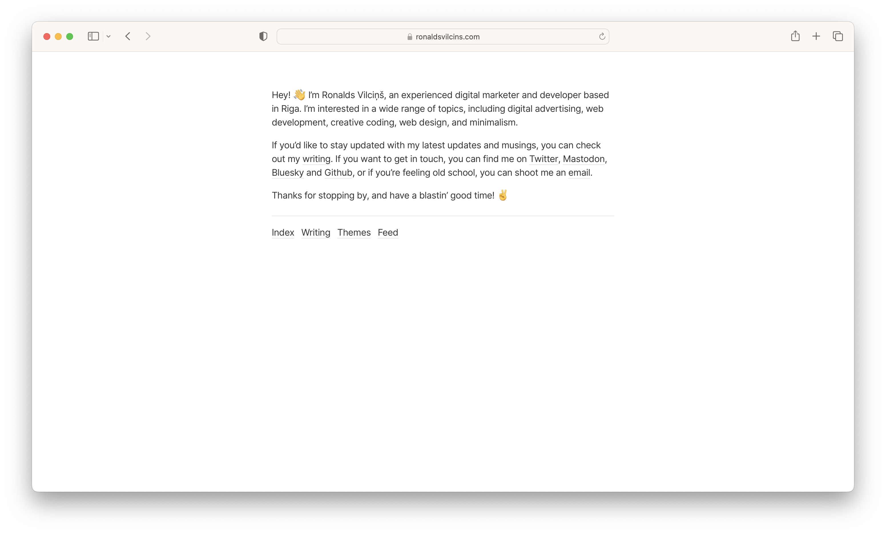

# Simplica Hugo theme

Simplica is content focused, minimal theme for Hugo. The theme is perfectly suitable for writers. No JS! AAA, 100/100 scores on Lighthouse, Gmetrix and Webpagetest!

### Features

- Minimalistic, clean and simple design
- Perfect for writers
- Content focused
- Inter fonts
- NO JS!
- AAA, 100/100 scores on Lighthouse, Gmetrix and Webpagetest
- Responsive design
- Inline CSS
- Atom feed
- Sass
- SEO optimized (Twitter cards, Facebook Open Graph, Schema.org)
- Ultra fast